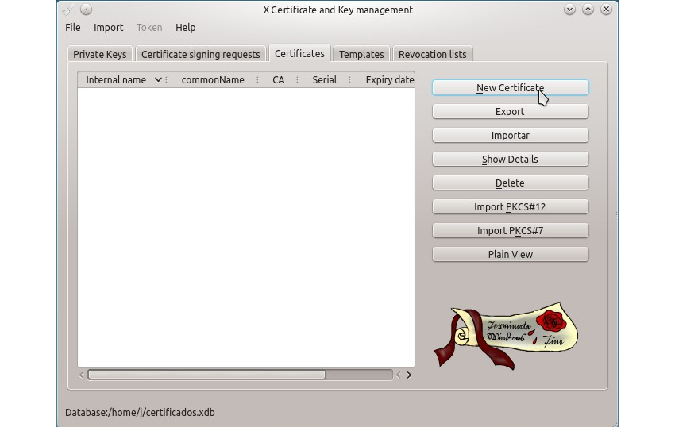
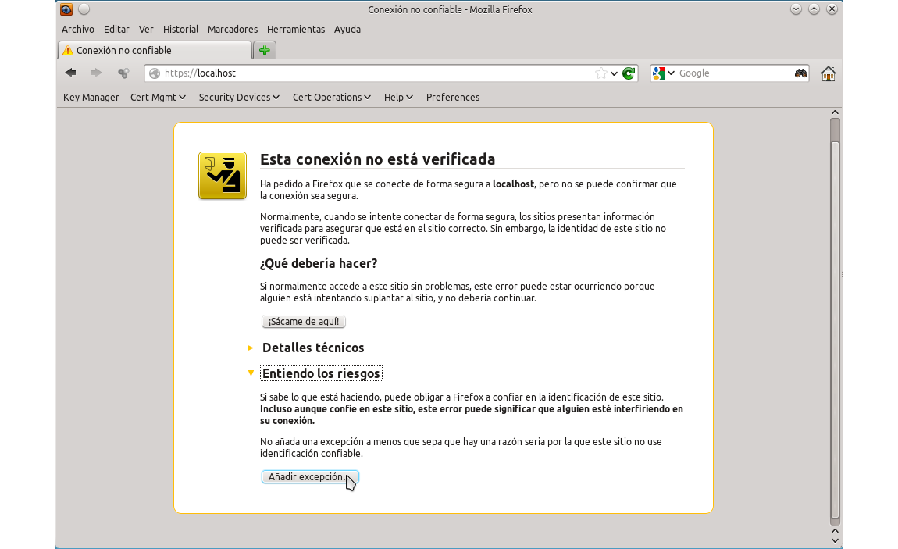

<!---
Ejemplos de inserción de videos

<video class="stretch" controls><source src="http://clips.vorwaerts-gmbh.de/big_buck_bunny.mp4" type="video/mp4"></video>
<iframe width="560" height="315" src="https://www.youtube.com/embed/3RBq-WlL4cU" frameborder="0" allowfullscreen></iframe>

slide: data-background="#ff0000" 
element: class="fragment" data-fragment-index="1"
-->

## Despliegue de aplicaciones web
---

<small> 2018-19 - IES Luis Vélez de Guevara - Écija - Spain </small>


## Servidores web

[](http://creativecommons.org/licenses/by-sa/4.0/)


## Índice
--- 
- ### Introducción
- ### Apache: Instalación
- ### Apache: Hosts virtuales
- ### Apache: Autenticación básica
- ### Apache: Servidor HTTPS 

<!--- Note: Nota a pie de página. -->


## Introducción


### En esta Unidad aprenderemos a

- Reconocer los parámetros de administración más importantes del servidor Web.
- Crear y configurar sitios virtuales.
- Establecer mecanismos para asegurar las comunicaciones entre el cliente y el servidor.
- Realizar los ajustes necesarios para la implantación de aplicaciones en el servidor Web.


## Apache: Instalación

**`apt  install  apache2`**


### Características

- Apache2 es el servidor web más usado actualmente.
- Es **software libre**.
- Tiene un **diseño modular**. 
- Directorio de configuración principal: **`/etc/apache2`**.
- Archivo de configuración principal: **`apache2.conf`**.
- Módulos en:
  - **`mods-available`** (disponibles)
  - **`mods-enabled`** (habilitados)
- Sitios en:
  - **`sites-available`** (disponibles)
  - **`sites-enabled`** (habilitados)

_módulos: tienen que estar disponibles y luego habilitarlos. Sitios: se crean y se habilitan_

### Archivos y carpetas

```
├── apache2.conf
├── conf-available
│   └── localized-error-pages.conf
├── conf-enabled
├── envvars
├── magic
├── mods-available
│   ├── ssl.conf
│   └── ssl.load
├── mods-enabled
│   ├── ssl.conf -> ../mods-available/ssl.conf
│   └── ssl.load -> ../mods-available/ssl.load
├── ports.conf
├── sites-available
│   ├── 000-default.conf
│   └── default-ssl.conf
└── sites-enabled
    └── 000-default.conf -> ../sites-available/000-default.conf
```
_enables: lo que hay es un enlace (a2dismod y a2enmod). Dar de alta sitios virtuales ()_

### Gestión del servicio

```bash
systemctl  start   apache2  # service apache2 start
systemctl  restart apache2  # service apache2 restart
systemctl  stop    apache2  # service apache2 stop
systemctl  status  apache2  # service apache2 status

systemctl  enable  apache2  
systemctl  disable apache2  
```

_comandos: service(más antiguo) y systemctl()._

_Los ultimos comandos para que se reinicie solo cuando se enciende el ordenador, o no (disable)... Si se apaga el apache hay que:systemctl  start   apache2, y para que cuando se inicie el equipo se active solo: systemctl  enable  apache2_

_systemctl es más lógico_

### Comandos

```bash 
a2dismod   # Deshabilitar módulo 
a2enmod    # Habilitar módulo

a2dissite  # Deshabilitar sitio
a2ensite   # Habilitar sitio
```
_apache2, en enable, mod módulo ¿ssl?_
_apache2, dis disable..._


## Apache: Hosts virtuales


### Características

- Apache2 permite tener varios sitios web compartiendo una dirección IP.
- Sitio por defecto en **`/var/www/html`**.
- Otros sitios virtuales en:
  - **`/var/www/sitio1`**, **`/var/www/sitio2`**, ...
- Por cada sitio virtual debe existir un archivo de configuración.
- Dicho archivo debe alojarse en:
  - **`/etc/apache2/sites-available`**  

_Otros sitios virtuales en: pueden ser los sitios virtuales en otros sitios, peor es recomendable hacerlo así_

### Archivo de configuración

**`/etc/apache2/sites-available/sitio.conf`**

_tb se puede poner sitio.com.conf_
_la carpeta donde apache tiene que mirar para servir (DocumentRoot)_

```xml
<VirtualHost *:80> 
  ServerName www.sitio.com
  ServerAdmin webmaster@sitio.com
  DocumentRoot /var/www/sitio

</VirtualHost>
```


### Comandos

```bash
a2dissite  sitio           # Deshabilita sitio
a2ensite   sitio           # Habilita sitio
service  apache2  restart  # Reinicia el servidor
```
_el reinicio se puede hacer tb se puede hacer con sytemctl en vez de service_

### Resolución de nombres

- Cuando escribimos una URL en el navegador, ésta debe ser traducida a una IP.
- Este procedimiento se conoce como resolución de nombres.
- Lo habitual es que se encargue el servicio DNS.
- Pero una solución rápida para pruebas, es editar el archivo **`/etc/hosts`**.

```
192.168.1.135   www.misitio.com
192.168.1.135   www.mimoodle.com
```
_Primero resuelve con el archivo host: misitio. Va delante de dns_
_system32/driver_
_resolucion de nombres en una red local sin neceitar montar un dns_


## Apache: Autenticación básica


### Características

- El usuario debe identificarse para acceder a un sitio o carpeta.
- Credenciales de usuario/contraseña.
- La constraseña se guarda cifrada en un archivo al que tiene acceso Apache.
- Para cifrar, usamos el comando **`htpasswd`**.
- Indicamos mediante directivas el tipo de autenticación y usuarios permitidos.
- El tráfico no viaja cifrado. No es un mecanismo muy seguro. 
- Actualmente se usa poco.

_un sitio o una parte sea solo accesible si el usuario tiene usuario y contraseña. La contraseña se guarda cifrada_
_como ususario puedo cambiar mi contraseña en al terminal con passw. Para cambiar el de otro ususario passw usuario_

### Comandos

```bash
mkdir     /var/www/passwd   # creamos directorio
cd        /var/www/passwd   # entramos en directorio
touch     .htpasswd         # creamos archivo
htpasswd  .htpasswd  jose   # añadimos usuario jose
```

Note: Ejecutar los comandos como usuario **root**.

_primer paso para crear la autenticación: carpeta no visible fuera_

### Directivas de autenticación

```xml
<VirtualHost *:80> 
  ServerName www.sitio.com 
  ServerAdmin webmaster@localhost 
  DocumentRoot /var/www/sitio

  <Directory /var/www/sitio> 
    AuthType Basic
    AuthName "Zona Privada"
    AuthUserFile /var/www/passwd/.htpasswd
    Require user jose juan
  </Directory>
</VirtualHost>
```

_Añadir el directory var www sitio... al archivo.conf del sitio virtual. Texto que aparece. _


## Apache: Servidor HTTPS


### Características

- Necesita de un certificado X.509.
- Dos tipos de certificados:
  - Autofirmados.
  - Firmados por una CA (Autoridad de Certificación).
- Permite que el tráfico viaje cifrado.
- Adicionalmente también permite autenciación si el certificado está firmado por una CA reconocida.
- HTTPS = HTTP + SSL/TLS

Note: **IMPORTANTE**: La negociación SSL es dependiente totalmente de la IP, así que no puedes servir distintos certificados en una misma IP.

_http y una capa de seguridad (ssl/tls), todo lo que va por aquí va cifrado._ 
_Certificado x.509 cae_
_Autofirmado: por nosotros mismos_
_CA: verising, visa, fábrica nacional de moneda y timbre [FNMT] (no todos los navehadores lo reconocen como seguro):ect/ssl/certs, o en el navegador/preferencias, seguridad _
_Let's encrypt authority te firma gratis: cuidado con eliminar los certificados, importar... saltar seguridad del equipo_ 
_tenemos que tener 1 certificado por 1 ip_


### Obtener un certificado

- **`make-ssl-cert`**
- **`openssl`**
- **`xca`**

_me falta cerbot: robot para obtener y renovar certificados_

_make: muy simple_
_openssl la más interesante. 

### make-ssl-cert

```bash
make-­ssl-­cert  /usr/share/ssl­-cert/ssleay.cnf  /etc/ssl/private/nombre­-sitio.pem
```

Note: El ejecutable `make-ssl-cert` viene en el paquete `ssl-cert`


### openssl

```bash
# Generamos clave privada
openssl genrsa -out key 1024

# Generamos CSR y firmamos con nuestra clave privada
openssl req -new -key key -out csr
openssl x509 -req -days 365 -in csr -signkey key -out crt

# Copiamos clave y certificado en el destino
cat key crt > /etc/ssl/private/nombre-sitio.pem
```

Note: CSR = Certificate Signing Request (solicitud de firma de certificado).

_PErmite hacer certificados y claves: clave privada (para firmar) y clave pública_
_metodos antiguos: 1 clave para cifrar y descifrar no vale para firmar_
_clave privada solo para mi, publica a todo el mundo: cualquiera que se quiera comunicar conmigo cifra con la publica, pero hace falta mi c.privada para descifrar_
_en el certificado está la clave pública, el navegador...¿?_
_generamos las claves: 1024 es muy poco, 2048, mejor, y ya se están usando 4096... Con computación cuántica esto se va a freir espárragos_
_ con la c privada firmamos nuestro certificado o el de otras personas. **csr certificado que no está firmado**. el nombre se puede cambiar (lo que aparece como csr en el comcando). dias de validez, entrada y generamos un certificado firmado_
_hay que configurar en el servidor la clave privada y _________
_cat meter privada y certificado firmado en un único archivo y mandarlo a..._
_estos archivos se pueen leer (key, csr y crt)_

### xca


_grafico y con funcion para windows. Hay que hacer una bd antes, generar las claves, genera el certificado y se firma (igual que antes). Librería de cifrado en linux, suelen estar echas en c y llaman a las funciones. Autofirmado: candado en gris, no se puede asegurar que eres quien dices ser_

### Archivo de configuración

**`/etc/apache2/sites-available/default-ssl.conf`**

```xml
<VirtualHost _default_:443> 
  ServerName nombre­-dominio-­sitio
  DocumentRoot /var/www/html
  
  SSLEngine on
  SSLCertificateFile  /etc/ssl/private/nombre-­sitio.pem
  ...
  
  <Directory /var/www/html> 
    SSLRequireSSL
    ...
  </Directory>
</VirtualHost>
```
_sitio virtual que se suele llamar así:default-ssl.conf_
_para que esto funcione hay que tener el ssl activado_

### Comandos

```bash
a2enmod   ssl

a2dissite default-ssl
a2ensite  default-ssl

service  apache2  restart
```
_desactivar, volver a activar y reiniciar_
_aparece una excepción. Después estará cifrado, otra cosa es que te lleve a donde dice llevarte_

Falta:
CERTBOT: bOT PARA LA GESTIÓN DE CERTIFICADOS DE lET's Encrypt
Es necesario disponer de un dominio registrado
https://certbot.eff.org
si se hace la petición desde el dominio?????? Protocolo ACME. Bot lo negocia todo. Genera un cetificado firmado por otra organización, que lo firma y lo da para 90 días, pero se renueva automáticamente.

### Resultado



_en amazon se crean servidores virtuales, freennom gestiona dominios (hay algunos gratuitos). Con ip no te dan el certificado, tiene que ser con dominio, por eso se hace esto_
