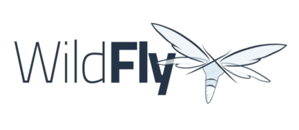
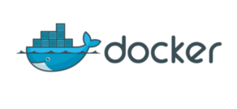

<!---
Ejemplos de inserción de videos

<video class="stretch" controls><source src="http://clips.vorwaerts-gmbh.de/big_buck_bunny.mp4" type="video/mp4"></video>
<iframe width="560" height="315" src="https://www.youtube.com/embed/3RBq-WlL4cU" frameborder="0" allowfullscreen></iframe>

slide: data-background="#ff0000" 
element: class="fragment" data-fragment-index="1"
-->

## Despliegue de aplicaciones web
---

<small> 2018-19 - IES Luis Vélez de Guevara - Écija - Spain </small>


## Servidores de aplicaciones

[](http://creativecommons.org/licenses/by-sa/4.0/)


## Índice
--- 
- ### Introducción
- ### Conceptos básicos
- ### Tomcat
- ### JBoss / WildFly
- ### Contenedores Docker

<!--- Note: Nota a pie de página. -->


## Introducción


### En esta Unidad aprenderemos a

- Identificar los principales archivos de configuración y de bibliotecas compartidas.
- Realizar los ajustes necesarios para el despliegue de aplicaciones sobre el servidor.
- Realizar pruebas de funcionamiento y rendimiento de la aplicación Web desplegada.
- Elaborar documentación relativa al despliegue de aplicaciones sobre el servidor de aplicaciones.


## Conceptos básicos


### Ediciones de Java

- **Java Card**
- **Micro Edition** (**ME**)
- **Standard Edition** (**SE**)
- **Enterprise Edition** (**EE**)
- **JavaFX** 


###  Tipos de archivos

- **JAR** (Java ARchive): Permite almacenar aplicaciones escritas en el lenguaje Java. Formato ZIP pero extensión .jar. 

- **WAR** (Web Application aRchive): Es un archivo JAR (con la extensión WAR) para distribuir archivos JSP, servlets, clases Java, archivos XML y contenido web estático (HTML). En conjunto constituyen una aplicación Web.

- **EAR** (Enterprise Application aRchive): Formato usado por Java EE para empaquetar en un sólo archivo varios módulos y para desplegar (mediante archivos XML llamados descriptores de depliegue) en un servidor de aplicaciones.


## TOMCAT

**Servidor web y Contenedor de servlets**


_Tomcat es: Contenedor de servlets (mini aplicaciones)_

### Instalación

```bash
# En Ubuntu 16.04 y 18.04
apt  install  tomcat8   tomcat8-admin

# Opcionalmente puede instalarse también
apt  install  tomcat8-docs  tomcat8-examples
```

Una vez instalado, Tomcat estará disponible en **http://localhost:8080**


### Configuración

```bash
/etc/tomcat8/
/etc/tomcat8/tomcat-users.xml
```

Insertamos las siguientes líneas en **/etc/tomcat8/tomcat-users.xml**.

```xml
<role rolename="manager-gui"/>
<role rolename="admin-gui"/>
<user username="tomcat" password="tomcat" roles="manager-gui,admin-gui"/>
```


### Construir webapp (I)

1. Descargamos código fuente de aplicación
2. Revisamos los siguientes archivos

  ```
  <SOURCE>/pom.xml
  <SOURCE>/src/main/resources/applicationContext.xml
  ```


### Construir webapp (II)

3. Construimos con maven

  ```bash
  mvn  clean  package
  ```

4. Revisamos los archivos generados

  ```
  <SOURCE>/target/<APP>.war 
  <SOURCE>/target/<APP>/  
  ```


### Desplegar en tomcat

1. Accedemos a **http://localhost:8080/manager/html**
2. Seleccionamos archivo **`.war`** a desplegar.
3. Y pulsamos en botón **Desplegar**.


###  Carpetas de una Webapp

```bash
/var/lib/tomcat8/
/var/lib/tomcat8/webapps/
/var/lib/tomcat8/webapps/<APP>/WEB-INF/web.xml
/var/lib/tomcat8/webapps/<APP>/WEB-INF/lib/
/var/lib/tomcat8/webapps/<APP>/WEB-INF/classes/
/var/lib/tomcat8/webapps/<APP>/WEB-INF/classes/applicationContext.xml
```

_Carpeta muy importante: WEB-INF.Dentro una carpeta por cada aplicación; lib:bibliotecas, clases: cl desplegadas, y archivo de configuración_


### Carpetas de una Webapp

- Directorio principal (raíz): Contendrá los ficheros estáticos (HTML, imágenes, etc...).
  - Carpeta **`WEB-INF`** : contiene el fichero **`web.xml`** (descriptor de la aplicación), encargado de configurar la aplicación.
    - Subcarpeta **`classes`** : contiene los ficheros compilados (servlets, beans).
    - Subcarpeta **`lib`** : librerías adicionales.
  - Resto de carpetas para ficheros estáticos.
  
  


## JBOSS / WILDFLY

**Servidor de aplicaciones**




### Características

- También conocido como **WildFly Application Server**
- Servidor de aplicaciones de código abierto.
- Implementa la especificación Java EE.
- Anteriormente conocido como **JBoss AS**.
- Escrito en Java. Desarrollado por **RedHat**.

_Maás potente que tomcat pero más difícil_


## Contenedores Docker


### VMs / Containers


### docker




### Características de docker

- Proyecto de código abierto.
- Actualmente es estándar de facto en contenedores. Otros sistemas son LXD, LXC, RKT, ...
- Permite automatizar el despliegue de aplicaciones dentro de "contenedores".
- Un contenedor empaqueta todo lo necesario para que una aplicación funcione: código y dependencias.
- No hay que preocuparse de qué software ni versiones tiene nuestra máquina.
- Un contenedor es un objeto portable, ligero y autosuficiente.


### Ventajas de docker

- Los contenedores se inician en pocos segundos.
- Son fácilmente replicables.
- Consumen menos recursos que las máquinas virtuales tradicionales.
- Ocupan mucho menos espacio.
- Permite aislar las dependencias de una aplicación de las instaladas en el host.
- Existe un gran repositorio de imágenes ya creadas, que además
pueden modificarse libremente. Es DockerHub: https://hub.docker.com


### Desventajas de docker

- Los contenedores no están 100% aislados. Usan el kernel del anfitrión.
- Mejor rendimiento en Linux que en otras plataformas.
- Existe cierta curva de aprendizaje.


### Comandos de docker

```bash
docker login
docker logout
docker pull ...
docker push ...
docker run ...
docker exec ...
docker images
docker ps
docker rmi ...
docker rm ...
```
_images: para ver las imagenes, ps: para ver los contenedores, rmi: borrar imagen, rm: borrar contenedores_

### docker run

- Nos permite ejecutar un contenedor a partir de una imagen.
- Si no tenemos la imagen localmente, entonces la descarga.

```bash
docker  run  -d  -p 8090:80  -v /var/www/html:/usr/share/nginx/html  nginx
```

_pone en funcionamiento un contenerdor_

**Opciones**

- `-d`, `--detach`:  libera el terminal, se ejecuta en segundo plano.
- `-p ...`, `--publish=...`: puertos de red mapeados en localhost.
- `-v ...`, `--volume=...`: directorios mapeados en localhost.


### docker exec

- Nos permite lanzar un ejecutable del interior del contenedor.
- A menudo el comando a lanzar es `bash`, para trabajar dentro del contenedor.

```bash
docker  exec  -it  9a60b60be82d  bash
```

_Ejecuta algún comando del interior del contenedor: conectarse al contenedor_

**Opciones**

- `-i`, `--interactive`: mantiene STDIN abierta
- `-t`, `--tty`: se reserva un terminal pseudo-TTY
- `9a60b60be82d`: es el ID del contenedor, puede obtenerse con `docker ps`


### docker-compose


### Características de docker-compose

- Permite definir y ejecutar aplicaciones multicontenedor. 
- Usa un archivo YAML para configurar los servicios de la aplicación.
- Dicho archivo por defecto se llama `docker-compose.yml`. 
- Con un solo comando, crea e inicia todos los servicios.


### Ejemplo docker-compose.yml

```yaml
version: "2"
services:
    tomcat:
        image: "tomcat:8.0-jre8"
        ports:
            - "8080:8080"
        depends_on:
            - sqlserver
    sqlserver:
        image: "microsoft/mssql-server-linux:2017-latest"
        environment:
            SA_PASSWORD: "Temporal22"
            ACCEPT_EULA: "Y"
        volumes:
            ./docs:/data
  ```


### Comandos de docker-compose

  ```bash
docker-compose  up  -d
docker-compose  down
```
