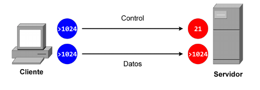

<!---
Ejemplos de inserción de videos

<video class="stretch" controls><source src="http://clips.vorwaerts-gmbh.de/big_buck_bunny.mp4" type="video/mp4"></video>
<iframe width="560" height="315" src="https://www.youtube.com/embed/3RBq-WlL4cU" frameborder="0" allowfullscreen></iframe>

slide: data-background="#ff0000" 
element: class="fragment" data-fragment-index="1"
-->

## Despliegue de aplicaciones web
---

<small> 2018-19 - IES Luis Vélez de Guevara - Écija - Spain </small>


## Servidores de transferencia de archivos

[](http://creativecommons.org/licenses/by-sa/4.0/)


## Índice
--- 
- ### Introducción
- ### Protocolo FTP
- ### vsFTPd: Instalación
- ### vsFTPd: Configuración

<!--- Note: Nota a pie de página. -->


## Introducción


### En esta Unidad aprenderemos a

- Instalar y configurar servidores de transferencia de archivos.
- Crear usuarios y grupos para el acceso remoto al servidor.
- Realizar pruebas con clientes en línea de comandos y clientes en modo gráfico.
- Utilizar el protocolo seguro de transferencia de archivos..


## Protocolo FTP


### FTP

**File Transfer Protocol** !

- Arquitectura **cliente/servidor**.
- El cliente solicita la transferencia y el servidor responde.
- El servidor usa por defecto 2 puertos: !
  - **Puerto 21**: puerto de control.
  - **Puerto 20**: puerto de datos.


### Clientes y servidores

- Clientes:
  - **ftp**  (terminal) !
  - gftp !
  - **filezilla** !
  - navegador web (`ftp://servidor`) navegar en un ftp público
- Servidores
  - **vsftpd** ! cuidado con la d very secure
  - proftpd
  
_Estos son los servidores más utilizados, nosotros trabajaremos con vsftpd_


### Tipos de usuarios

- **Usuario anónimo**: 
  - no disponen de cuenta en el servidor.
  - conectan con `anonymous`/`correo@dominio`. ! anonymous y correo
  - Permisos de sólo lectura. !
- **Usuarios del sistema**: 
  - disponen de cuenta en el servidor. **Pueden iniciar sesión** de terminal. mediante ssh
  - conectan con `usuario`/`clave`.
- **Usuarios virtuales**
  - disponen de cuenta en el servidor. **NO pueden iniciar sesión** de terminal. 
  - conectan con `usuario`/`clave`.


### Modos de transferencia

- **Texto**: para transferir archivos que sólo tienen caracteres imprimibles: txt, html, ...
- **Binario**: para transferir cualquier tipo de archivo: pdf, jpg, ... Es el modo **recomendado**. !


### Modos de funcionamiento

**Activo**


_Es el modo más antiguo, el cliente trabaja con puertos mayores del 1024 y hace la peticíon a un puerto 21 (de control), el servidor envía los datos a través del puerto 20: no es seguro, porque alguien se puede interponer. Lo normal: el cliente abre un puerto por encima de 1024_

**Pasivo**



_El cliente se conecta al puerto mayor de 1024  y el servidor informa del puerto por el que se debe acceder. No puerto 20 (uno por encima de 1024)y el cliente es siempre quien inicia la conexión_ !


### Seguridad !

- FTP es un protocolo no seguro.
- Existen 2 formas de hacerlo seguro:
  - **Usar SSH**: es necesario una conexión ssh subyacente.
    - **SFTP** (SSH File Transfer Protocolo) ! Por debajo usa ssh
  - **Usar SSL/TLS**: es necesario un certificado digital.
    - **FTPS**. Usa los puertos 990 (control) y 989 (datos). !
    - **FTPES**. Más moderno. Recomendado. ! 
    
_SFTP No es que conecte por SSH, sino que fpt lo usa por debajo_
_FTPES: e es de explícito_


## vsFTPd: Instalación

**`apt  install  vsftpd`**


### Gestión del servicio ! con el comando service no se puede habilitar y deshabilitar

```bash
systemctl  start   vsftpd  # service vsftpd start
systemctl  restart vsftpd  # service vsftpd restart
systemctl  stop    vsftpd  # service vsftpd stop
systemctl  status  vsftpd  # service vsftpd status

systemctl  enable  vsftpd  
systemctl  disable vsftpd  
```


## vsFTPd: Configuración !

**`/etc/vsftpd.conf`**


### Usuario anónimo !!

```bash
# Permitir acceso anónimo !!
anonymous_enable=YES

# Directorio por defecto
anon_root=/srv/ftp/

# Puede acceder sólo a archivos legibles por todo el mundo
anon_world_readable_only=YES
```
_Directivas del archivo: `/etc/vsftpd.conf`_


### Usuarios locales 

**También se aplica a los usuarios virtuales**

```bash
# Permitir el acceso a los usuarios locales y virtuales !
local_enable=YES

# Permisos de escritura !
write_enable=YES

# Permisos de las carpetas: 777-022=755
# Permisos de los archivos: 666-022=644
local_umask=022
```
_la máscara por defecto suele ser la 022_


### Enjaular usuarios locales !

**También se aplica a los usuarios virtuales**

```bash
# Enjaulamos a todos los usuarios 
# excepto los indicados en /etc/vsftpd.chroot_list
chroot_local_user=YES !
chroot_list_enable=YES
chroot_list_file=/etc/vsftpd.chroot_list
```
_por defecto se enjaula a todo el mundo, que el ususario no salga de un sistema de archivos y las excepciones irán en /etc/vsftpd.chroot_list_


### Usuarios virtuales

- Son muy útiles si tenemos varios sitios virtuales en nuestro servidor web.
- Cada sitio virtual pertenece a un usuario.
- Una forma sencilla de crear un usuario virtual es la siguiente. !tipo test para que reconozcamos el comando

```bash
adduser  --shell /bin/false  --home /var/www/usuario   usuario   !!esta línea es el comando para añadir usuario
echo "/bin/false" >> /etc/shells
```
_cada usuario debería tener un directorio en la carpeta /var/www/usuario(shell está false)_
_De esta forma: adduser  --shell /bin/false  --home /var/www/usuario   usuario se añaden todos los usuarios que quieras_


### FTP seguro

- Necesitaremos un certificado digital.
- Podemos utilizar el que viene en Ubuntu
  - /etc/ssl/private/ssl-cert-snakeoil.key  ( clave privada )
  - /etc/ssl/certs/ssl-cert-snakeoil.pem    ( certificado )
- O podemos generar uno nosotros.

```bash
# Generamos clave privada y certificado en un único archivo
make-ssl-cert  \
   /usr/share/ssl-cert/ssleay.cnf \
   /etc/ssl/private/vsftpd.pem
```
! Tipo test pero no. Los que vienen por defecto en ubuntu: /etc/ssl/private/ssl-cert-snakeoil.key  ( clave privada )
   /etc/ssl/certs/ssl-cert-snakeoil.pem    ( certificado )


### FTP seguro !!

```bash
# Activar el soporte SSL
ssl_enable=YES  !!

# Se habilitan los soportes para las diversas versiones de SSL ! 2 y 3 son las más modernas
ssl_tlsv1=YES
ssl_sslv2=YES
ssl_sslv3=YES

# Cifrado. 
# El cifrado (DES-CBC3-SHA) por defecto no es soportado por filezilla.
ssl_ciphers=DEFAULT

# Se especifica la ubicación del certificado generado y la clave priva !!rsa_cert_file y rsa_private_key_file
rsa_cert_file=/etc/ssl/private/vsftpd.pem
rsa_private_key_file=/etc/ssl/private/vsftpd.pem
```


### FTP seguro explícito

```bash
# FTP explícito (FTPES)
implicit_ssl=NO  !!
listen_port=21
require_ssl_reuse=NO
```
!! Desactivar el implícito
